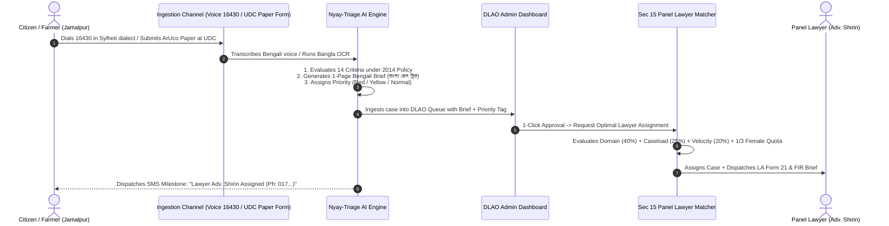
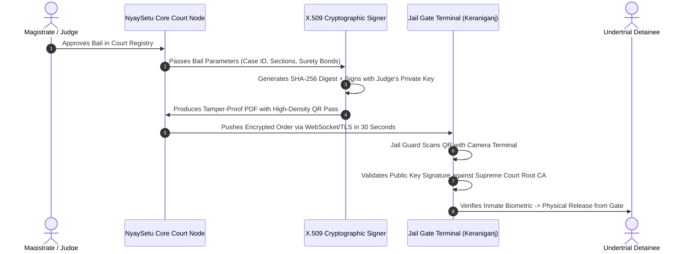
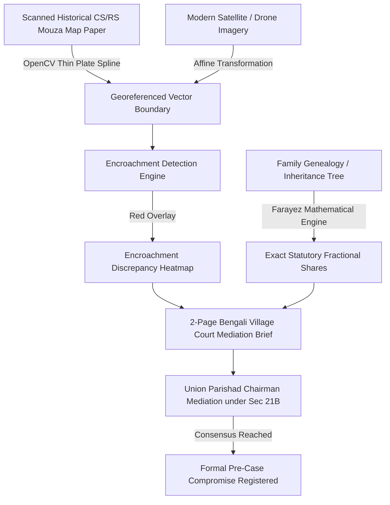

# NyaySetu (ন্যায়সেতু) — Comprehensive System Explanation & Operational Blueprint

**"No device, no literacy, no distance, no delay — no citizen left outside justice."**  
*Document Version: 1.0.0 (Master Architecture & Operational Guide)*  
*Prepared for: National Legal Tech Hackathon BD 2026 (EU • UNDP • Ministry of Law)*

---

## Table of Contents
1. [Executive Overview: What is NyaySetu?](#1-executive-overview-what-is-nyaysetu)
2. [The "What is What" Glossary & System Breakdown](#2-the-what-is-what-glossary--system-breakdown)
   - [The 4 Inclusive Access Tiers](#21-the-4-inclusive-access-tiers)
   - [The Core Subsystems & Innovations](#22-the-core-subsystems--innovations)
   - [The Legal Framework Decoded](#23-the-legal-framework-decoded)
3. [How Things Actually Work (End-to-End Operational Workflows)](#3-how-things-actually-work-end-to-end-operational-workflows)
   - [Workflow A: Citizen Intake to Assigned Legal Aid Lawyer](#workflow-a-citizen-intake-to-assigned-legal-aid-lawyer)
   - [Workflow B: 30-Second FastBail-BD Release from Prison Gate](#workflow-b-30-second-fastbail-bd-release-from-prison-gate)
   - [Workflow C: Bhoo-Chitra Rural Land Dispute Reconciliation](#workflow-c-bhoo-chitra-rural-land-dispute-reconciliation)
   - [Workflow D: HabeasAlert Algorithmic Over-Detention Watchdog](#workflow-d-habeasalert-algorithmic-over-detention-watchdog)
4. [Technology Architecture & Component Interaction](#4-technology-architecture--component-interaction)
5. [48-Hour Hackathon Working Prototype Playbook](#5-48-hour-hackathon-working-prototype-playbook)
   - [What is Live vs. What is Simulated](#51-what-is-live-vs-what-is-simulated)
   - [Stage Presentation & Live Demo Choreography](#52-stage-presentation--live-demo-choreography)

---

## 1. Executive Overview: What is NyaySetu?

### The Core Problem in Bangladesh
Bangladesh's formal judicial system is burdened with **4.64 million pending cases**, with over **70% of all prison inmates being undertrial detainees** who have never received a trial verdict. 

Although Bangladesh enacted the **Legal Aid Services Act 2000** and established the **National Legal Aid Services Organization (NLASO)** with District Legal Aid Offices in all 64 districts, less than **3% of underprivileged citizens** successfully utilize government legal aid due to three structural failures:
1. **The Digital & Literacy Divide:** 25%+ of the impoverished population cannot read or type text, and 50M+ rural citizens rely exclusively on basic 2G button phones. Traditional web portals completely fail them.
2. **The Bureaucratic Processing Bottleneck:** Only **27 full-time District Legal Aid Officers (DLAOs)** serve 64 districts. Each DLAO spends up to 70% of their day manually reading 40-page handwritten Bengali police reports and typing statutory forms (LA Forms 20 to 25).
3. **The 14-Day Paper Dispatch Delay:** Even after a court grants bail to an indigent undertrial, releasing them requires physical paper bail orders to be stamped, couriered, and hand-delivered between court clerks and prison gates, causing weeks of unlawful over-detention.

### What NyaySetu Accomplishes
**NyaySetu (ন্যায়সেতু — The Justice Bridge)** is an **omnichannel, 4-tier legal aid operations infrastructure** that connects grassroots citizens directly to district courts and correctional facilities. It pairs sovereign, open-source telephony and physical paper auto-bridging with an intelligent, explainable judicial operations engine.

```
       ┌──────────────────────────────────────────────────────────────┐
       │                   CITIZEN ACCESS CONTINUUM                   │
       └──────────────────────────────────────────────────────────────┘
          Tier 0: Paper Forms + ArUco Scanner (4,554 Union Centres)
          Tier 1: 2G Button Phone + Voice AI (*16430# USSD + Hotline)
          Tier 2: WhatsApp Voice/Photo Bot + Sub-2MB Offline PWA
                                     │
                                     ▼
       ┌──────────────────────────────────────────────────────────────┐
       │              NYAY-TRIAGE INTELLIGENCE ENGINE                 │
       │   • 2014 Policy Means-Testing (14 Statutory Categories)      │
       │   • 1-Page Bengali Case Brief (বাংলা কেস ব্রিফ)              │
       │   • Priority Triage (Red: Undertrials / Yellow: ADR)         │
       └──────────────────────────────────────────────────────────────┘
                                     │
                                     ▼
       ┌──────────────────────────────────────────────────────────────┐
       │                 JUSTICE OPERATIONS BACKBONE                  │
       │   • FastBail-BD: 30-Second PKI Cryptographic Bail Dispatch   │
       │   • Sec 15 Panel Matching (Strict 1/3 Female Lawyer Quota)   │
       │   • Bhoo-Chitra: CS/RS Historical Land Map AI Warping        │
       │   • 1-Click Generation of Statutory Forms (LA 20 to 25)      │
       └──────────────────────────────────────────────────────────────┘
```

---

## 2. The "What is What" Glossary & System Breakdown

### 2.1 The 4 Inclusive Access Tiers

| Tier Name | Target Demographic | Interface / Medium | How It Works |
| :--- | :--- | :--- | :--- |
| **Tier 0: Paper Auto-Bridging** | Completely illiterate citizens, elderly rural women, char/haor day laborers with **no phone or electricity**. | Physical pre-printed paper forms with **ArUco alignment markers** and QR anchors. | The citizen visits any of the **4,554 Union Digital Centres (UDCs)** or Village Courts (*গ্রাম আদালত*). The entrepreneur fills out the form with a pen and scans it with a standard webcam. Local Bangla OCR parses handwriting and checkmarks with **zero data-entry typing**. |
| **Tier 1: 2G Feature Phone** | 50M+ citizens possessing basic keypad button phones without mobile internet. | Voice call to **16430 Hotline** + Zero-Data **`*16430#` USSD**. | An interactive voice bot built on FreeSWITCH PBX greets the caller in dialect-fluent Bangla (Sylheti, Chatgaya, standard). Speech-to-text transcribes the caller's dispute. The citizen can dial `*16430#` with zero mobile balance to track status. |
| **Tier 2: Smartphone & Citizen** | Urban working poor, garment workers, smartphone owners with low data connectivity. | **WhatsApp Legal Bot** + **Sub-2MB Offline-First PWA**. | Citizens send WhatsApp voice notes or camera photos of police FIRs or court summons. The PWA caches entirely in browser IndexedDB, functioning even in total rural internet blackout zones. |
| **Tier 3: Justice Operations Backbone** | District Legal Aid Officers (DLAOs), Panel Lawyers, Jail Superintendents, and Judges. | Web-based **Enterprise Operations ERP Dashboard**. | Automated statutory means-testing, workload-balanced panel lawyer matching, over-detention census watchdogs, and cryptographic digital bail dispatch. |

---

### 2.2 The Core Subsystems & Innovations

#### 1. Nyay-Triage (স্মার্ট ট্রায়াজ ইঞ্জিন)
- **What it is:** The central judicial classification engine.
- **Function:** When an application is ingested from any tier, Nyay-Triage analyzes the facts in under 5 seconds. It checks the applicant against the **14 statutory eligibility criteria** under Paragraph 2 of the *National Legal Aid Policy 2014*, tags urgency (`🔴 Red Alert: Undertrial / Trafficking`, `🟡 Medium: Pre-case Mediation`), and generates a standardized **1-Page Bengali Case Brief (`বাংলা কেস ব্রিফ`)**.

#### 2. FastBail-BD (দ্রুত জামিন নেটওয়ার্ক)
- **What it is:** A secure, digitally signed bail dispatch network connecting District Courts to Central and District Jails.
- **Function:** When a judge signs a bail grant, the system signs a digital token using **X.509 PKI (SHA-256 encryption)** and embeds it in a high-density QR code. It transmits directly to the Jail Superintendent’s terminal in **under 30 seconds**, replacing physical paper couriers that take 7 to 21 days.

#### 3. HabeasAlert (হেবিয়াসঅ্যালার্ট ওয়াচডগ)
- **What it is:** An algorithmic jail census watchdog.
- **Function:** Automatically cross-references daily jail inmate rosters against statutory custody limits under the *Code of Criminal Procedure (CrPC)*. If a detainee has been held without trial beyond statutory limits, it triggers a `🔴 Red Alert` on the DLAO dashboard to draft an immediate emergency bail petition.

#### 4. Bhoo-Chitra (ভূ-চিত্র এআই)
- **What it is:** Computer Vision historical cadastral map alignment engine.
- **Function:** Resolves rural land boundary conflicts (responsible for **60%+ of all civil litigation**). It warps historical colonial Cadastral Survey (CS, 1888) and Revisional Survey (RS, 1970) mouza paper sheets over modern satellite and drone photography, generating a clear, color-coded encroachment report and calculating exact inheritance shares under **Farayez (ফারাযেজ)**.

#### 5. KanthoNyay (কণ্ঠন্যায় ভয়েস এআই)
- **What it is:** Dialect-tolerant voice intelligence for the 16430 national helpline.
- **Function:** Understands non-standard regional dialects (Sylheti, Chittagonian, Noakhali) using fine-tuned open-source Whisper models. Converts colloquial voice complaints into structured legal dockets.

#### 6. Nari-Shield (নারী-শিল্ড স্টিলথ মুড)
- **What it is:** A discreet domestic abuse intake interface built into the PWA and WhatsApp bot.
- **Function:** Allows female survivors to report domestic violence silently. Features a **one-tap panic escape** that instantly masks the screen into a harmless weather or recipe app, with zero saved browser history to protect victims from retaliatory partner violence.

#### 7. Nyayatori (ন্যায়তরি ভ্রাম্যমাণ কিট)
- **What it is:** A solar-powered, water-resistant floating legal aid tablet kit for field paralegals in flood-prone riverine char and haor communities.

---

### 2.3 The Legal Framework Decoded

Every algorithm and form in NyaySetu strictly aligns with Bangladesh statutory law:

```
┌──────────────────────────────┬────────────────────────────────────────────────────────┐
│ STATUTE / REGULATION         │ NYAYSETU ARCHITECTURAL ENFORCEMENT                     │
├──────────────────────────────┼────────────────────────────────────────────────────────┤
│ Legal Aid Services Act 2000  │ • Section 7: Universal legal representation for poor   │
│                              │ • Section 13: Procedural intake and application rights │
│                              │ • Section 15: Panel lawyer appointment & quota control │
│                              │ • Section 21B: Mandatory Pre-Case Mediation (ADR)      │
├──────────────────────────────┼────────────────────────────────────────────────────────┤
│ National Legal Aid Policy    │ • Paragraph 2(1)(a): Income ceiling (< BDT 150k/year)  │
│ 2014 (Amended 2026)          │ • Paragraph 2(2): 14 statutory eligibility classes     │
│                              │ • Paragraph 3: Free general consultation for all       │
├──────────────────────────────┼────────────────────────────────────────────────────────┤
│ Code of Criminal Procedure   │ • Section 154: First Information Report (FIR) parsing  │
│ (CrPC 1898)                  │ • Section 173: Police Final Investigation Report       │
│                              │ • Section 496, 497, 498: Statutory bail entitlements   │
├──────────────────────────────┼────────────────────────────────────────────────────────┤
│ Village Courts Act 2006      │ • Section 3 & Schedule Part 1: Local civil disputes up │
│ (Amended 2013)               │   to BDT 75,000 diverted to Union Parishad mediation   │
├──────────────────────────────┼────────────────────────────────────────────────────────┤
│ ICT Act 2006                 │ • Sections 4–7: Legal recognition of X.509 electronic  │
│                              │   cryptographic signatures for court bail orders       │
└──────────────────────────────┴────────────────────────────────────────────────────────┘
```

---

## 3. How Things Actually Work (End-to-End Operational Workflows)

### Workflow A: Citizen Intake to Assigned Legal Aid Lawyer



#### Step-by-Step Breakdown:
1. **Citizen Submission:** An impoverished citizen in Jamalpur dials `16430` or visits a Union Digital Centre.
2. **AI Processing:** 
   - Speech-to-text converts the dialect audio into structured text.
   - The LLM parses penal code references, incident dates, and the monthly family income.
   - It cross-references Paragraph 2 of the *2014 Legal Aid Policy* and determines statutory qualification (`PASSED: Income < BDT 150k + Agricultural Wage Laborer`).
   - It condenses a 35-page police report into a **150-word 1-Page Bengali Case Brief (`বাংলা কেস ব্রিফ`)**.
3. **DLAO Review:** The District Legal Aid Officer opens their dashboard. Instead of spending 45 minutes reading the raw FIR, they review the 1-Page Brief in **30 seconds** and click **"Approve & Match Lawyer"**.
4. **Algorithmic Assignment:** 
   - The matching engine analyzes 50 panel lawyers.
   - It checks subject matter expertise (Criminal Law), proximity to the court, and active case count (preventing lawyer burnout).
   - It checks the statutory **1/3 Female Lawyer Quota**. If female allocation is below 33.3%, female advocates are prioritized.
5. **Instant Notification:**
   - The appointed advocate receives the 1-Page Brief and auto-generated **LA Form 21**.
   - The citizen receives an automated SMS: `আপনার দরখাস্ত গৃহিত হয়েছে। আইনজীবী: শিরিন আক্তার (০১৭...)।`

---

### Workflow B: 30-Second FastBail-BD Release from Prison Gate



#### Step-by-Step Breakdown:
1. **Judicial Grant:** The Sessions Judge or Magistrate hears the bail petition and marks the bail order as granted in the court registry.
2. **Cryptographic Signing:** FastBail-BD generates a digital court release manifest containing the prisoner's National ID, Jail Registry ID, FIR Case Number, and Surety Bond requirements. The server signs this payload using an **X.509 digital certificate (SHA-256)** and renders a cryptographic QR token on the release certificate.
3. **Instant Electronic Dispatch:** In **under 30 seconds**, the encrypted package arrives at the Central Jail terminal via an authenticated TLS tunnel.
4. **Gate Verification:** The jail gate officer scans the QR code using a dedicated terminal or smartphone. The app verifies the signature against the Supreme Court / Ministry of Law public key directory:
   - `✅ VERIFIED: Order issued by Dhaka 3rd Court of Sessions Judge at 11:42 AM. Valid.`
5. **Physical Release:** The prisoner is released that very afternoon, **saving 7 to 14 days of illegal incarceration**.

---

### Workflow C: Bhoo-Chitra Rural Land Dispute Reconciliation



#### Step-by-Step Breakdown:
1. **Historical Map Warping:** The field paralegal uploads a photo of a colonial **CS 1888** or **RS 1970** mouza map. Bhoo-Chitra detects corner survey anchors (chanda points) and applies **Thin Plate Spline (TPS)** transformation to warp the distorted paper map over high-resolution satellite imagery.
2. **Encroachment Heatmap:** The algorithm calculates the boundary delta between the registered deed (khatian) and the actual modern ridge or fence visible from above:
   - `🟢 Green Zone:` Undisputed plot area.
   - `🔴 Red Zone:` Encroached boundary overlap (e.g., *0.04 decimals encroached on North boundary*).
3. **Farayez Share Partitioning:** If the dispute stems from inheritance feuds, the paralegal enters the heirs (e.g., 2 sons, 3 daughters, 1 widow). The deterministic engine computes exact statutory Quranic fractions, drawing geometric division lines directly on the plot map.
4. **Mediation Brief:** The system outputs a **2-page visual mediation report in Bengali** for the Village Court Chairman. Faced with indisputable visual aerial proof, 80%+ of disputants reach an amicable settlement in hours, avoiding 15 years of court litigation.

---

### Workflow D: HabeasAlert Algorithmic Over-Detention Watchdog

```
[Daily Jail Census Ingestion (64 District Jails)]
                       │
                       ▼
┌─────────────────────────────────────────────────────────────┐
│             HABEASALERT STATUTORY RULE ENGINE               │
├─────────────────────────────────────────────────────────────┤
│ Condition 1: Undertrial detention > Maximum offense term    │
│ Condition 2: No trial hearing scheduled within 180 days     │
│ Condition 3: Qualified under 2014 Policy Para 2(2)(dha)     │
└─────────────────────────────────────────────────────────────┘
                       │
             ┌─────────┴─────────┐
      MATCH FOUND          NO BREACH
             │                   │
             ▼                   ▼
┌─────────────────────────┐  [Normal Roster]
│  🔴 RED ALERT TRIGGERED │
│  • Alert DLAO Dashboard │
│  • Auto-Draft Form 23   │
│  • Emergency Habeas     │
│    Corpus Petition      │
└─────────────────────────┘
```

#### Step-by-Step Breakdown:
1. Every evening, the jail roster (detainee ID, penal sections, date of admission, date of last court appearance) is matched against statutory custody limits.
2. If a citizen accused of petty theft (maximum sentence 2 years) has been held in jail for 28 months without trial, **HabeasAlert flags the case immediately**.
3. It pre-populates **LA Form 23 (Register of Undertrial Prisoners Entitled to Legal Aid)** and alerts the District Legal Aid Officer with a notification:
   - `🚨 URGENT: Prisoner #4812 (Kashimpur) over-detained by 4 months. Statutory defense mandatory under Section 7(1)(c).`

---

## 4. Technology Architecture & Component Interaction

NyaySetu is built on an enterprise, sovereign architecture designed for Bangladesh's low-resource environment:

```
┌──────────────────────────────────────────────────────────────────────────────┐
│                              CLIENT ACCESS LAYER                             │
│   • Retro Feature Phones (*16430# USSD)      • ArUco Scanners (4,554 UDCs)   │
│   • WhatsApp Business Webhook                • Offline PWA (Service Workers) │
└──────────────────────────────────────┬───────────────────────────────────────┘
                                       │ HTTPS / WSS / SIP
                                       ▼
┌──────────────────────────────────────────────────────────────────────────────┐
│                          EDGE & TELEPHONY GATEWAY                            │
│   • FreeSWITCH / Asterisk SIP PBX Server (Open Source Telecom)               │
│   • Whisper Automatic Speech Recognition (Bangla Dialects: Sylheti/Chatgaya)│
│   • PaddleOCR / Tesseract (Bengali Printed & Handwritten Text Extraction)    │
└──────────────────────────────────────┬───────────────────────────────────────┘
                                       │ Internal JSON RPC
                                       ▼
┌──────────────────────────────────────────────────────────────────────────────┐
│                         CORE APPLICATION SERVICES                            │
│   • Python FastAPI (AI Microservices, Legal Brief Extraction, FastBail)      │
│   • Java Spring Boot 3 + Flowable (Statutory BPMN Workflow & Form Generator) │
│   • Node-Forge / OpenSSL (X.509 PKI Digital Signature Subsystem)             │
│   • PostGIS Geospatial Engine (Mouza Map Alignment & Encroachment Polygon)   │
└──────────────────────────────────────┬───────────────────────────────────────┘
                                       │
                                       ▼
┌──────────────────────────────────────────────────────────────────────────────┐
│                           STORAGE & SECURITY LAYER                           │
│   • PostgreSQL 16 with Row-Level Security (RLS) & Column AES-256 Encryption  │
│   • Redis (Active Dialect Call Caching & Rate Limiting)                      │
│   • WORM Storage (Write-Once-Read-Many Audit Logs for Evidentiary Chain)     │
└──────────────────────────────────────────────────────────────────────────────┘
```

---

## 5. 48-Hour Hackathon Working Prototype Playbook

### 5.1 What is Live vs. What is Simulated

To build and demonstrate a winning solution in 48 hours, the system is partitioned into **functional live code** and **cleanly simulated edge services**:

```
┌─────────────────────────────────────────────────────────────────────────────┐
│                      48-HOUR WORKING LIVE DEMO (100% REAL)                   │
├─────────────────────────────────────────────────────────────────────────────┤
│  1. Live Bengali Voice/Text Intake & 3-Second AI Triage                     │
│  2. Live 1-Page Bengali Case Brief (বাংলা কেস ব্রিফ) Generation             │
│  3. Live Statutory Means-Test Evaluator (2014 Policy Rules Engine)          │
│  4. Live 1-Click Official PDF Form Generator (LA Form 21 & 23)              │
│  5. Live FastBail PKI Digital Signature Generator & Smartphone Camera Scan  │
│  6. Live Panel Lawyer Matching Panel with 1/3 Female Quota Gauge            │
├─────────────────────────────────────────────────────────────────────────────┤
│                      SIMULATED / MOCKED (CLEAN PROTOCOL)                    │
├─────────────────────────────────────────────────────────────────────────────┤
│  • USSD Gateway (*16430#): Displayed via an interactive retro phone screen. │
│  • Telecom Lines: Browser WebRTC mic replaces physical BTRC E1 fiber trunks.│
│  • National Jail Roster: Pre-populated realistic synthetic 50-inmate census.│
└─────────────────────────────────────────────────────────────────────────────┘
```

---

### 5.2 Stage Presentation & Live Demo Choreography (3-Minute Winning Pitch)

When presenting to judges (EU, UNDP, Ministry of Law), follow this exact **3-Minute Stage Sequence**:

#### Minute 0:00 – 0:45: The Reality & The Stakes (Emotional & Grounded)
- *"Judges, 70% of Bangladesh’s 80,000 prisoners have never received a trial verdict. Why? Because legal aid is locked behind paper forms and 14-day courier delays that exclude rural citizens who cannot read or own smartphones."*
- Introduce **NyaySetu**: *"An omnichannel justice bridge connecting an illiterate farmer's voice directly to court registries and jail gates."*

#### Minute 0:45 – 1:30: Live Citizen Voice & AI Triage Demo (Technical Magic)
- Open the prototype on a laptop or mobile phone.
- **Speak into the microphone in Bengali:** *"আমার নাম রহিমা। আমার স্বামী দিনমজুর, জমি নিয়ে মারামারি হওয়ায় জামিন পাইতেছে না তিন মাস ধরে।"*
- **The Magic:** In 3 seconds, the screen updates with:
  1. `ELIGIBILITY: APPROVED (Para 2(2)(dha) - Indigent Detainee Family)`
  2. `1-Page Case Brief Generated: Pen. Code Sec 323/506 • Urgent Bail Needed`
  3. `Priority: 🔴 RED ALERT`

#### Minute 1:30 – 2:15: Live FastBail-BD & Smartphone Scan (The Showstopper)
- Switch to the Judge / Legal Aid Officer dashboard.
- Click **"Grant Bail"**.
- FastBail-BD generates a digital certificate with a signed QR code.
- **Pull out your smartphone on stage**, point the camera at the screen, and scan the QR code.
- The phone instantly displays:  
  `✅ VERIFIED BAIL ORDER — SHA-256 SIGNATURE VALID — Release Undertrial #4812 Immediately`.
- Tell the judges: *"We just reduced a 14-day postal delay to 30 seconds."*

#### Minute 2:15 – 3:00: Statutory Grounding, Quotas & Impact (The Closer)
- Show the **Section 15 Lawyer Matching Panel** with the **33% Female Quota meter** in action.
- Show the 1-click downloadable **official LA Form 21 PDF**.
- Conclude: *"NyaySetu is not a chatbot. It is a sovereign, legally compliant justice pipeline aligned with the 2000 Act, the 2014 Policy, and CrPC. Ready for deployment across Bangladesh's 64 districts."*

---

*NyaySetu (ন্যায়সেতু) — Developing Justice for Every Citizen of Bangladesh.*
